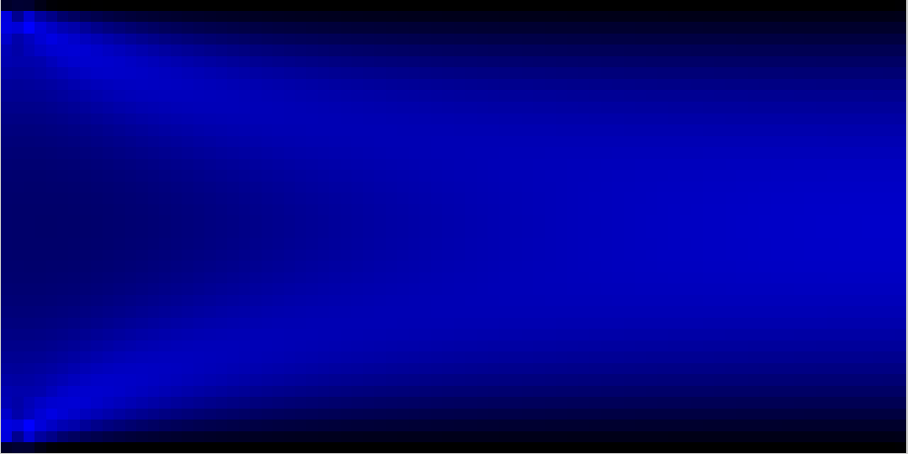

# lattice-boltzmann
A simple implementation of the Lattice Boltzmann Method with solutions to simple problems in computational fluid dynamics (CFD).

lbm.c contains functions for each step of the actual LBM algorithm, while the demo files contain implementations used during development to verify behavior of the solver. Boundary conditions are handled on a per-problem basis between the collision step and the streaming step with custom handling depending on the geometry.

The demo files contain examples for any boundary condition one would *technically* need to solve any 2D fluid flow problem. In practice, complicated boundaries (curved boundaries, i.e. circles or airfoils or other shapes which don't neatly fit within the square grid) need special treatment and are not provided here.

*Demo 1* models the shockwave developing from an initial pressure condition. Boundary conditions are no-slip (bounceback) on every wall. Symmetry of solution is expected and is a simple sanity check for the solver alongside long-term convergence of density.

*Demo 2* models lid-driven cavity flow in a laminar regime. Boundary conditions are no-slip (bounceback) on side walls and floor and fixed velocity (momentum) condition on the lid. With many timesteps (~100,000), clear steady-state streamlines emerge as expected in a square cavity.

*Demo 3* models free flow through a channel. Boundary conditions are velocity (momentum) inlet on the left, a pressure (zero-gradient) outlet on the right, and no-slip (bounceback) on the top and bottom. Rapid convergence to steady-state flow with zero velocity at wall boundaries emerges as expected.

Left: shockwave from pressure shock. Right: lid-driven cavity flow.

Above: free flow through a channel.
