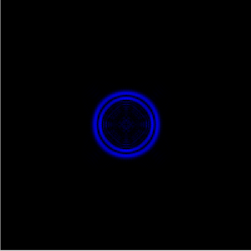
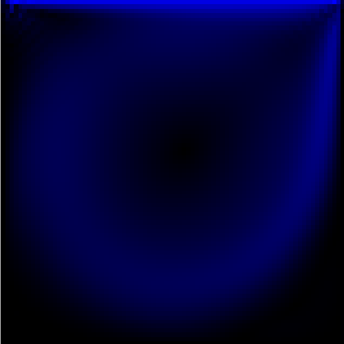

# lattice-boltzmann
A simple implementation of the Lattice Boltzmann Method with solutions to simple problems in computational fluid dynamics (CFD).

lbm.c contains functions for each step of the actual LBM algorithm, while the demo files contain implementations used during development to verify behavior of the solver. Boundary conditions are handled on a per-problem basis between the collision step and the streaming step with custom handling depending on the geometry.

The demo files contain examples for any boundary condition one would *technically* need to solve any 2D fluid flow problem. In practice, complicated boundaries (curved boundaries, i.e. circles or airfoils or other shapes which don't neatly fit within the square grid) need special treatment and are not provided here.

## Demo Files
*Demo 1* models the shockwave developing from an initial pressure condition. Boundary conditions are no-slip (bounceback) on every wall. Symmetry of solution is expected and is a simple sanity check for the solver alongside long-term convergence of density.

*Demo 2* models lid-driven cavity flow in a laminar regime. Boundary conditions are no-slip (bounceback) on side walls and floor and fixed velocity (momentum) condition on the lid. With many timesteps (~100,000), clear steady-state streamlines emerge as expected in a square cavity.

*Demo 3* models free flow through a channel. Boundary conditions are velocity (momentum) inlet on the left, a pressure (zero-gradient) outlet on the right, and no-slip (bounceback) on the top and bottom. Rapid convergence to steady-state flow with zero velocity at wall boundaries emerges as expected.

## Future Work
This is essentially a barebones implementation of the D2Q9 lattice Boltzmann method. In the future, I will (hopefully, if I can find the time) be adding some more features:
1. **GPU Computation with Cuda**. Even relatively small problems would benefit greatly from parallel computation. For example, the cavity flow example on a relatively small (80x80) grid required roughly 100,000 steps of the LB algorithm to converge to steady-state. With this minimally efficient implementation, that amounted to several hours. Alongside GPU computation, some basic speedups are possible throughout (i.e. avoiding divisions by defining new variables, avoiding repeated multiplications of constants, etc).
2. **Convergence Checks**. There are currently no formal methods implemented for checking convergence. I have largely verified this by hand for these problems (through print statements and evaluating the density plot). Formal checks would eliminate the need for fixed runtimes.
3. **Save/Load Feature**. Currently no method to save results or read in partially completed simulations. I would like to at least be able to save each f_i value to a csv file and subsequently read that into the program; everything else can be computed from these.
4. **Vector Plotting**. The current visualization engine is barebones and only assigns magnitude to points on the domain. A simple solution could involve simply writing vectors to a file to be read by an outside program, i.e. GNUPlot.
